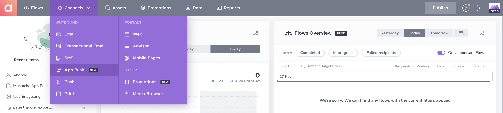
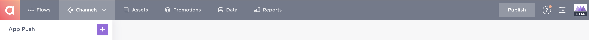
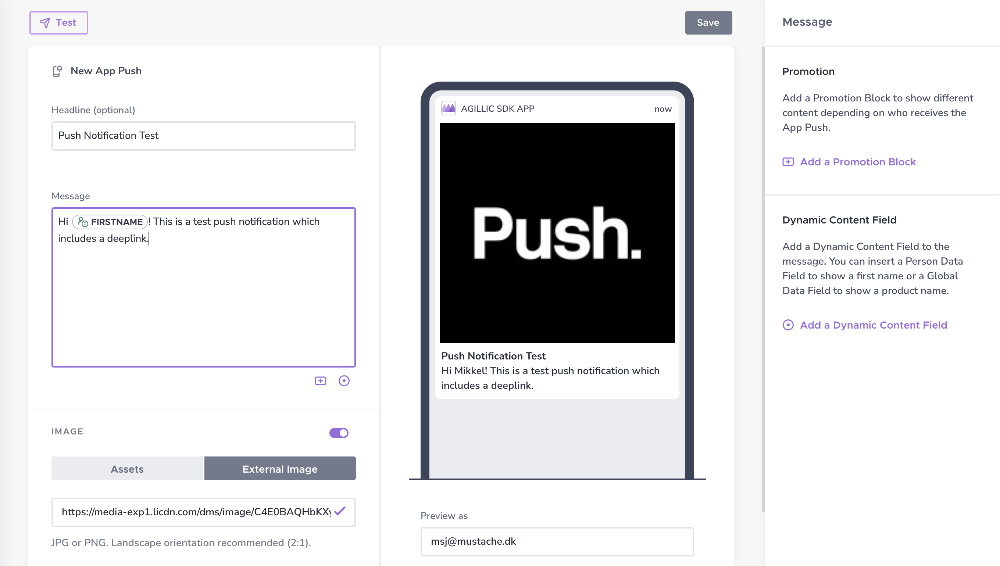
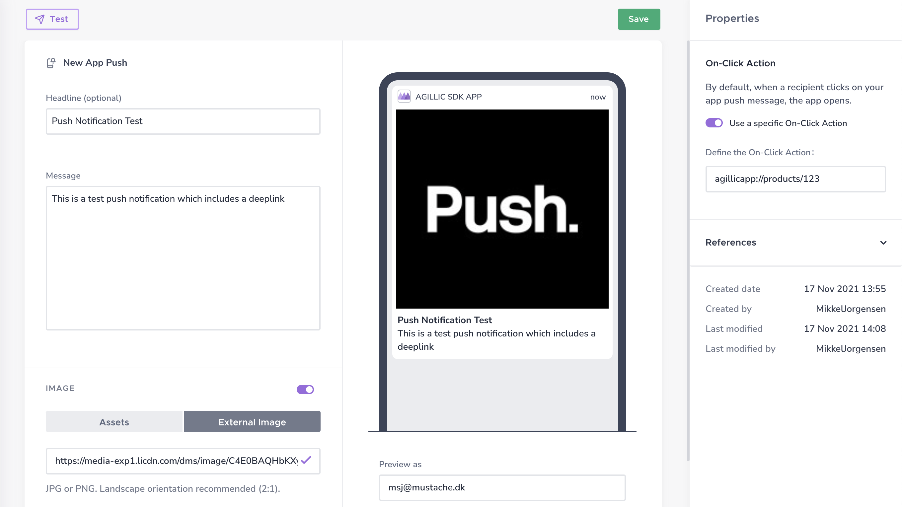
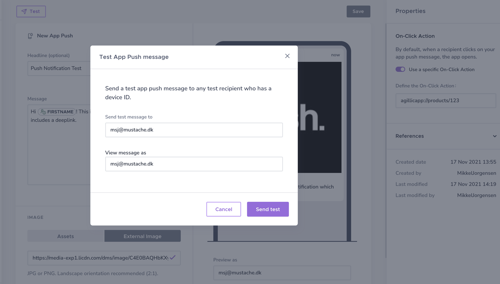
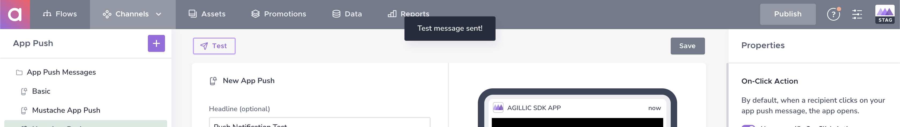

# Agillic Push Notification Setup

## Introduction

This document will show you how to use the Agillic Dashboard to test that your Agillic Solution has been succesfully registered as a push provider in Agillic Settings and verify that the Agillic Solution has registered a push notification token from your Android application.

---
## Before we begin
This document assumes that you have implemented the Agillic SDK into your iOS application and successfully registered a push notification token within your Agillic Solution.

## App Push Test

To get started, login to your Agillic Solution and select **Channels** and **App Push** in the menu bar.

Click the purple + icon to create an App Push template.

To create your push notification you must add a message and a recipient. [Click here to learn how to create a target group and define your recipients](https://support.agillic.com/hc/en-gb/articles/360006745932-How-to-Check-your-Recipients-One-to-Many-data).

When creating your message, you can add dynamic content fields referencing your recipient data and Promotion Blocks to show different content depending on who receives the App Push.

Optionally you may also add a headline, an image and a deeplink which will be included in the push notification payload.

When you are done, click save.

To test the push notification click the **Test** button. Then add recipient and define which promotions should be triggered by adding which recipient the message should be viewed as.

Finally click **Send test**

This should trigger a push notification in your Android application. [View the SDK README to learn how to access and read the push notification message and payload, which will include a deeplink if included in the App Push test](../README.md#Introduction).

