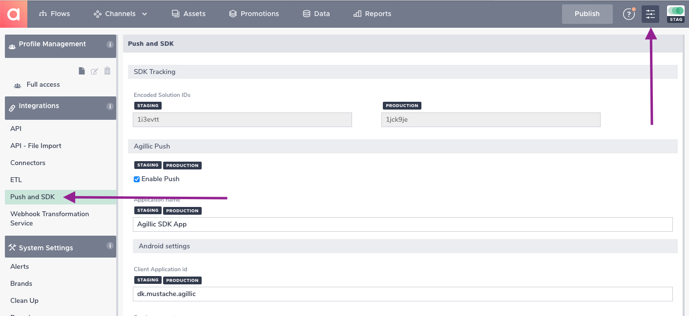

# Configuration of the Agillic Solution

## Introduction

This section will help you to configure the Agillic Solution an 
obtain the keys and id's you need to be able configure and initialize
the AgillicMobileSDK into your iOS application.

---

Login to your Agillic Solution and select **Settings** in the top right corner.

Next, select **Push and SDK** in the left pane Menu, under **Integrations** 

---
