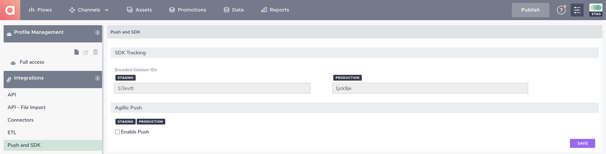
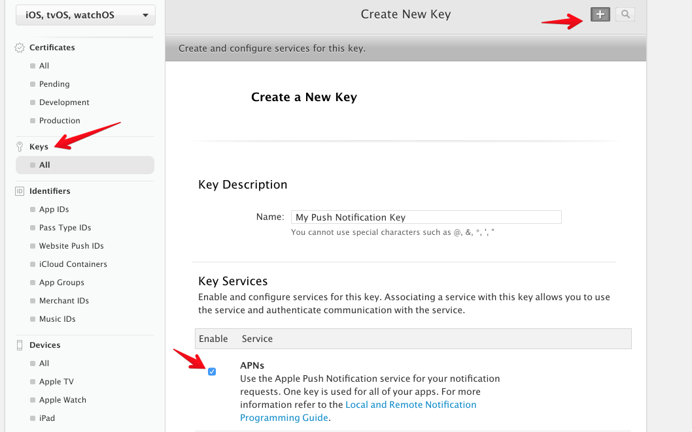

# Configuration of the Agillic Solution

## Introduction

This section will help you to configure the Agillic Solution an 
obtain the keys and id's you need to be able configure and initialize
the AgillicMobileSDK into your iOS application.

---

To get started, login to your Agillic Solution and select **Settings** in the top right corner.

## SDK Configuration

In order to configure the SDK in your iOS application you will need to reference your Agillic `solutionId`, `apiKey` and `apiSecret`.

Click **Push and SDK** in the left sidebar to view your staging and production solution IDs.

Click **API** in the left sidebar to view or create a developer key and secret.

Note the `Developer Key` is the `apiKey` in the Agillic SDK
Note the `Secret` is the `apiSecret` in the Agillic SDK

## Push Notifications

Next, select **Push and SDK** in the left pane Menu, under **Integrations** and check the "enable push" checkbox

**Enter application name**

This is the name of your application (typically what it says in the AppStore)

**Enter Client Application id** 

This has to correspond to the Bundle identifier of your iOS application (**VERY IMPORTANT**)

### iOS Authentication Token

The Agillic Soltion uses the ios Authentication Token to connect to Apple Push Notificaion services.

- Read more [Authentication Tokens](https://developer.apple.com/library/content/documentation/NetworkingInternet/Conceptual/RemoteNotificationsPG/CommunicatingwithAPNs.html#//apple_ref/doc/uid/TP40008194-CH11-SW1)
- Go to [Member Center](https://developer.apple.com/account/ios/certificate/distribution/create)
- Create a `Key` for push notification. Download as `.p8` file.

- Note your `key id`

- Note your `team id` on [Account Membership](https://developer.apple.com/account/#/membership)

- In `PushNotifications`, select `.p8` file, fill out `key id`, `team id`, `bundle id`, `device token`, `message`, select `environment`

