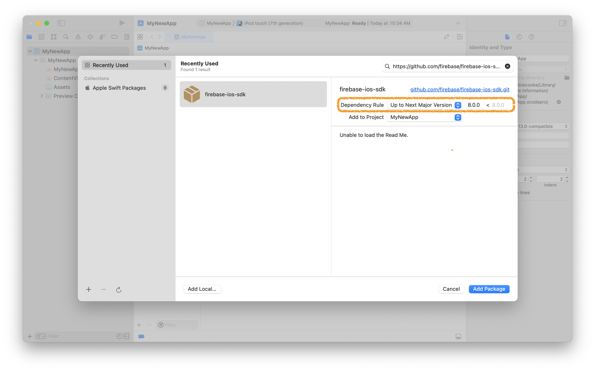
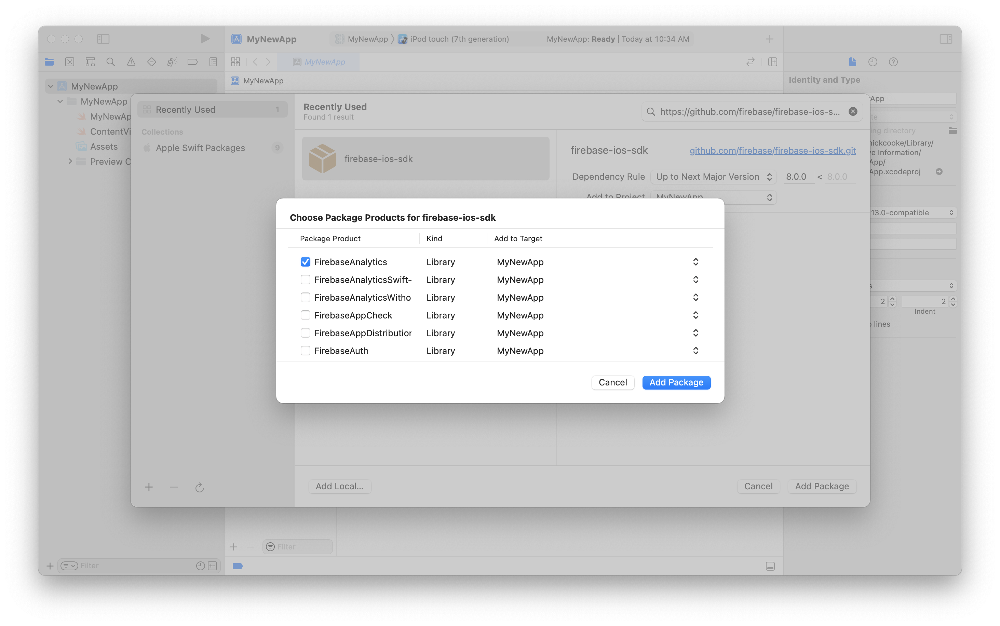

# Swift Package Manager for Agillic SDK

## Introduction

Starting with the 0.7.0 release, Agillic SDK for iOS officially supports installation via [Swift
Package Manager](https://swift.org/package-manager/).

## Requirements

- Requires Xcode 12.5 or above
- Analytics requires clients to add `-ObjC` linker option.
- See [Package.swift](Package.swift) for supported platform versions.


## Installation

### Installing from Xcode

Add a package by selecting `File` → `Add Packages…` in Xcode’s menu bar.

---

Search for the Agillic iOS SDK using the repo's URL:
```console
https://github.com/agillic/agillic-ios-sdk.git
```

Next, set the **Dependency Rule** to be `Up to Next Major Version` and specify `0.0.0` as the lower bound.

Then, select **Add Package**.

<div align = "center"></div>

---

Choose the Agillic SDK that you want installed in your app.

<div align = "center"></div>

---

### Alternatively, add Agillic SDK to a `Package.swift` manifest

To integrate via a `Package.swift` manifest instead of Xcode, you can add
Firebase to the dependencies array of your package:

```swift
dependencies: [
  .package(
    name: "AgillicSDK",
    url: "https://github.com/agillic/agillic-ios-sdk.git",
    .upToNextMajor(from: "0.0.0")
  ),

  // Any other dependencies you have...
],
```

Then, in any target that depends on the Agillic SDK, add it to the `dependencies`
array of that target:

```swift
.target(
  name: "MyTargetName",
  dependencies: [
    .product(name: "AgillicSDK", package: "AgillicSDK"),
  ]
),
```
